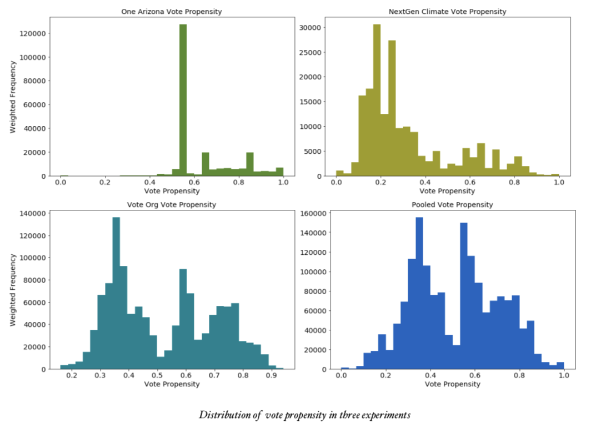
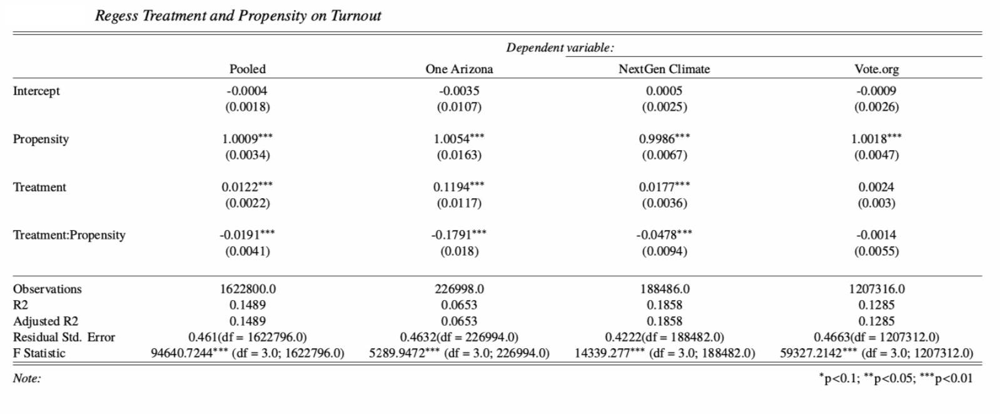
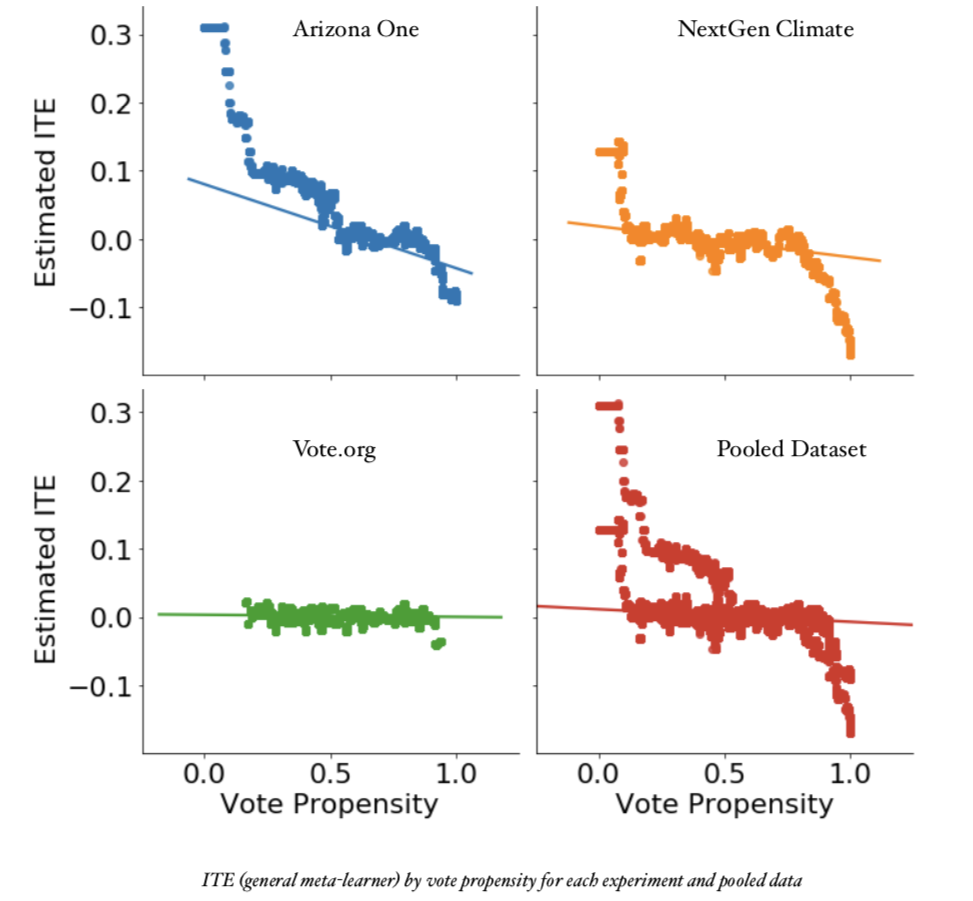

# Optimize Intervention Allocation in Field Experiments

This project is to gauge the individual treatment effect in randomized controlled trials using Meta-Learner, a machine learning framework. And then provide advice for next round intervention allocation based on the pattern we found in individual effects. You can read my full description in `thesis.pdf`.

**Affiliation**: [Institute for Social and Economic Research and Policy](http://iserp.columbia.edu/), Columbia University.

**Keywords**: Randomized Controlled Trails (RCT), Meta-Leaner

**Software**:  

- Python : `econml`, `linearmodels`, `statsmodels` `sklearn`

**Scope**

- Exploratory analysis on three text-messaging voter mobilization experiments
  conducted before 2016 general election.

  |Experiment|  Treatment Group    |  Control Group    | Script |
  | ----------------- | ---- | ---- | ---- |
  |       One Arizona Campaign            |     200,442 |   50,187   |`code/One Arizona Experiment.ipynb`|
  |         NextGen Climate Campaign          |   94,257   |   94,229   |`code/NextGen Climate Experiment.ipynb`|
  |          Vote.org         |  905,396    |    301,920  |`code/Vote Org Experiment.ipynb`|
|Pooled| 1,019,697|446,336|`code/Pooled Analysis.ipynb`|

- Estimate individual treatment by regression with interaction term
- Estimate individual treatment by meta-learner approach

## Exploratory analysis  

## Regression

## Meta-Learner

